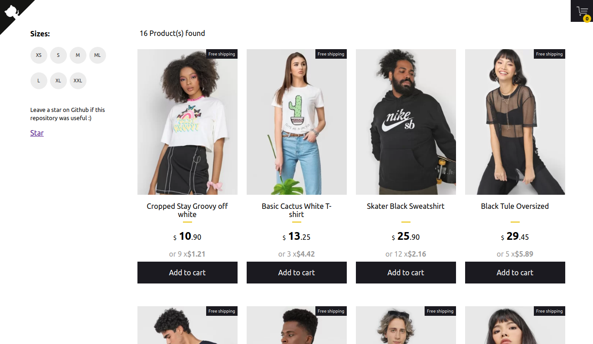

## 🛍️ Simple ecommerce cart application [](https://circleci.com/gh/jeffersonRibeiro/react-shopping-cart)

<p align="center">

  
</p>

## Basic Overview - [Live Demo](https://react-shopping-cart-67954.firebaseapp.com/)


#### Features

- Add and remove products from the floating cart using Context Api
- Filter products by available sizes using Context Api
- Responsive design

<!--
## Getting started

Try playing with the code on CodeSandbox :)

[](https://codesandbox.io/s/74rykw70qq)
 -->

## Build/Run

#### Requirements

- Node.js
- NPM

```javascript

/* First, Install the needed packages */
npm install

/* Then start the React app */
npm start

/* To run the tests */
npm run test

```
